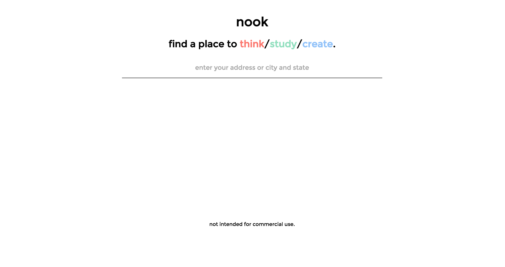
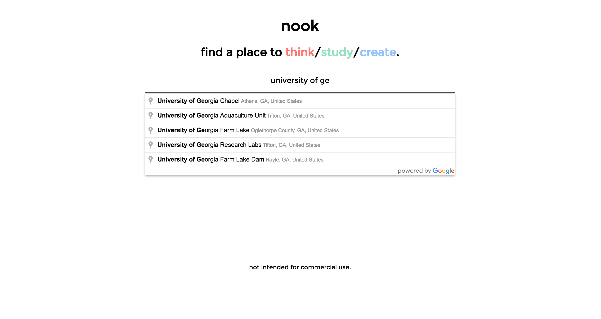
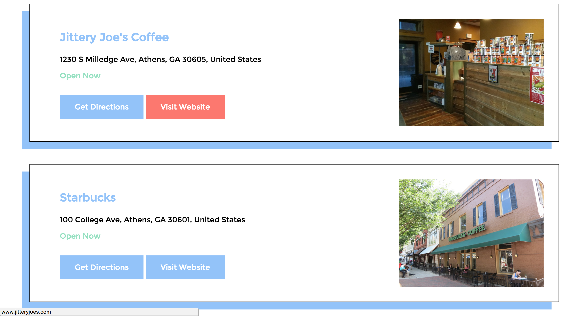

# nook

## About
Nook is a mobile-friendly, single page web application that finds nearby study spots -- including coffee shops and public libraries -- based on the user's location. This was a short project for me to practice working with AngularJS and the Google Maps Javascript API.

## Features
The user can search by address, city, or place using the Google Autocomplete input box. The app then displays each study spot along with a photo, whether it is currently open or not, link to the Google url (for directions or more detailed information), and website, if applicable.

## Screenshots

> Home page

> Typing in location with Autocomplete

> Immediate results with map

> Hovering over the Website button in one of the search results

## Challenges
Overall, the Google Maps API was intuitive and easy to use (thanks to the documentation and plenty of examples). My main challenge was how to avoid going over the request query limit for the location url and websites. My two main choices were to a) use a setTimeOut to delay requests once the limit was reached, or b) run the service only after an event (such as the user clicking on a location, and then the location expanding to display the link and website buttons). I decided to go with the first because immediately displaying the "Directions" and "Website" buttons is more intuitive than b) from a usability standpoint.

## Future Features
* Add more study locations (i.e. public parks)
* Sort by study location type
